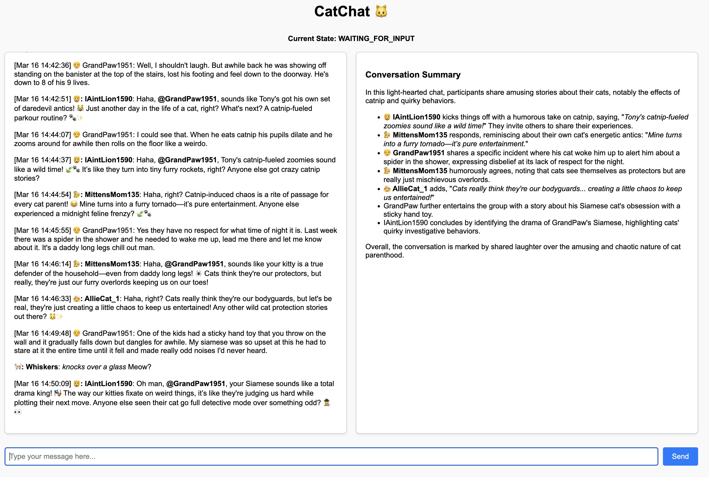

# CatChat

A demo of using GenAIScript to create an interactive conversational application. Any [GenAIScript configuration](https://microsoft.github.io/genaiscript/getting-started/configuration/) could be used. For the demo `openai:gpt-4o-mini` works best. If you want to use local models from `ollama` comment out the `files: ['rag/**/*.*']` or they struggle.

## 🐱 Overview

Simulates a chat room where:

- A user inputs messages
- AI participants respond to the conversation
- An AI agent manages and summarizes the conversation
- A virtual cat interjects

## 🧩 Pieces

- **Server**: Express/Socket.IO server handling HTTP routes and real-time communication
- **CatChat**: Main state machine orchestrating the conversation inside a GenAIScript with a run loop
- **Cat**: AI agent that simulates cat behavior and is subscribed to state changes
- **Participant**: AI agents representing human participants in the chat
- **Scribe**: AI agent tracks and stores conversation history
- **RAG**: A folder containing interesting cat info is referenced by the AI agents

## 🚀 Setup

### Prerequisites

- Node.js
- npm
- GenAIScript VS Code extension (if Debugging)

### Steps

1. Clone the repository
2. Install dependencies

   ```bash
   npm install
   ```

3. Configure environment variables (copy `.env.genaiscript.sample` to `.env.genaiscript`. [

   ```
   OPENAI_API_KEY=your_openai_api_key
   ```

4. Open the folder in VS Code

5. Navigate to the `cat-chat.genai.mts` script and click the `Run GenAIScript...` or `Debug GenAIScript...` menu option, or run via the terminal `npx genaiscript run cat-chat`

6. A browser will launch and open `http://localhost:3000`


